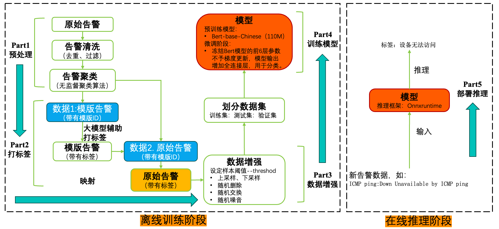
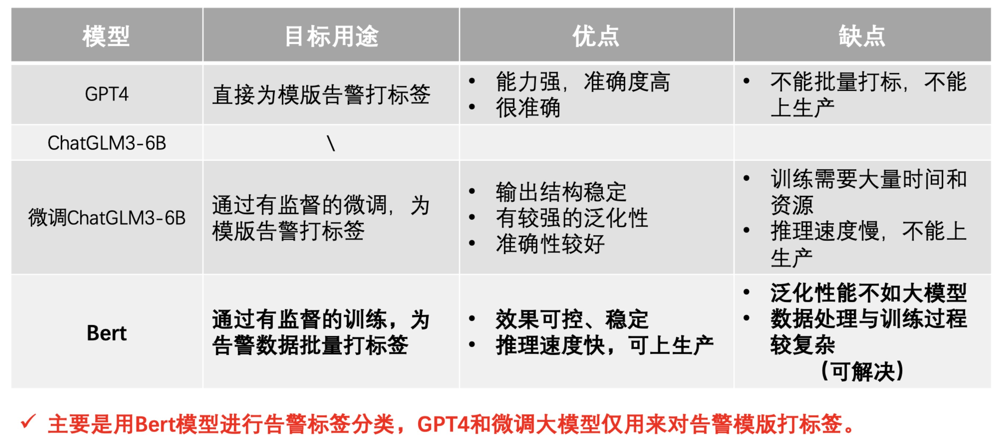

# 基于BERT的告警文本分类算法

## 1. 项目简介

**告警标签**是对告警数据的归纳，能够简单直观的反映告警信息。将告警数据简化成标签，可以降低告警风暴，不同的标签结合能够清晰反映故障发生的机理和影响范围，从而能够更方便发现根因、解决故障。

告警标签分类算法，采取**大小模型**相结合的策略，依赖生成式模型（GPT）强大的运维知识与文本生成能力，为模板告警打上标签，构建训练集；依赖判别式模型（BERT）对告警文本强大的学习与分类能力，对新告警数据进行批量推理，满足生产环境中对高效率与高准确性的要求

## 2. 运行流程



## 3. 资源包

```
|--lab
    |--config
        ｜--标签分布映射
        ｜--标签类别映射
    |--dataset
        ｜--大模型标签
        ｜--聚类模版
        ｜--数据增强
        ｜--推理输出
        ｜--训练数据
        ｜--原始告警
    |--img
        ｜--llm.jpg
        ｜--WechatlMG735.jpg
    |--models
        ｜--model.onnx
    |--pretrain_models
        ｜--bert-base-chinese
    |--ASParser.py
    |--data_enhancement.py
    |--findAllDelimiters.py
    |--llm_api.py
    |--onnxInference.py
    |--sim.py
    |--train_model.py
    |--utils
    |--Part1-告警聚类.ipynb
    |--Part2-模型标签.ipynb
    |--Part3-数据扩展.ipynb
    |--Part4-训练模型.ipynb
    |--Part5-模型验证.ipynb
    |--Part6-场景验证.ipynb
```

##### 大模型与小模型优缺点及主要用途：


